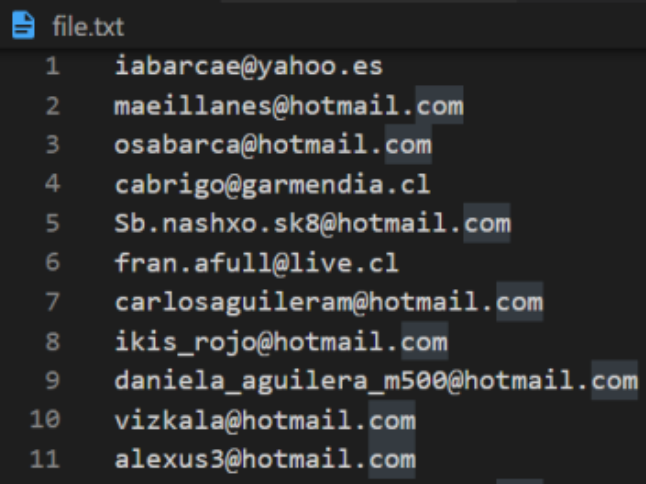
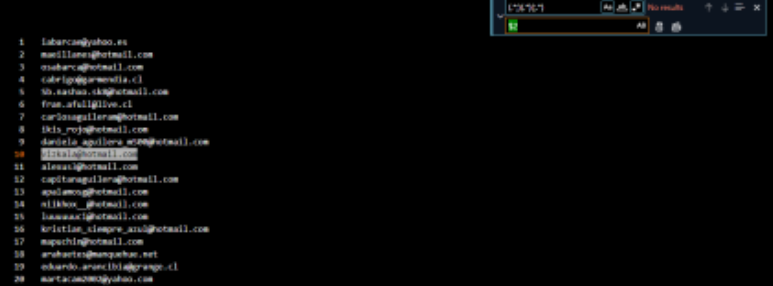

# Ejercicios Regex

Para realizar los ejercicios, no basaremos en el siguiente fichero: https://gist.github.com/DavidBernalGonzalez/c3514686f695f5a13b8ce4c0d0aa67c3

### **Ejercicio 1:** Basándote en el fichero original, añade un “)” inmediatamente después del primer número del resultado debe ser el siguiente: 

**BUSQUEDA:** ^(?\<no\>\d+)(\s) 

**REEMPLAZO:** $1)

***

### **Ejercicio 2:** Basándote en el fichero original, haz que todos los elementos tengan un solo espacio entre palabra y palabra. Por tanto, es necesario quitar tabulaciones y doble espaciados. Además, también debes de seleccionar los espacios del final independientemente de si son tabulaciones o espacios. 

**BUSQUEDA:** \s{1,}

**REEMPLAZO:** “ “

***

### **Ejercicio 3:** Basándote en el fichero original, sustituye todos los correos que tengan:
* ### **Subdominio:** @ lo que sea 
* ### **Y acaban en :** cl o ch
### Por ejemplo:

### El resultado será el siguiente: 

**BUSQUEDA:** (@)(\w+)(\\.cl|\\.ch) 

**REEMPLAZO:** $1gmail$3

***

### **Ejercicio 4:** Elimina todo lo que no sea un email: 

### El resultado final debe de ser el siguiente: 

**BUSQUEDA:** ([\\w.\\.-]+@[\\w.\\.-]+) 

**REEMPLAZO:** ;$1;

**BUSQUEDA:** (.\*; )(.\*)(;.\*) 

**REEMPLAZO:** $2

