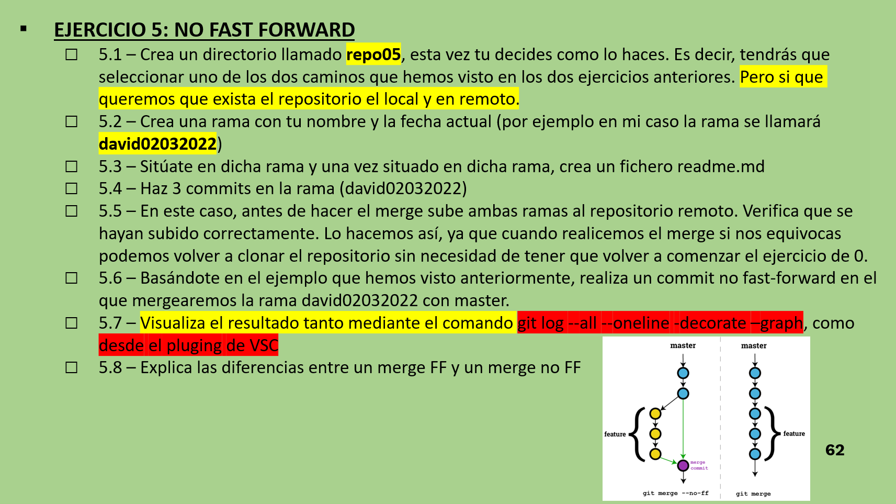

# Ejercicios GIT 5

## Ejercicio 5.1

Como en ejercicios anteriores creamos un repositorio queeste en remoto y local.

## Ejercicio 5.2

Como el ejercicio anterior, creamos una rama con nuestro nombre y la fecha actual.

## Ejercicio 5.3

Nos situamos en la rama y creamos un readme

## Ejercicio 5.4

Modificamos 3 veces el readme y hacemos tres commits (uno por cada modificacion).

## Ejercicio 5.5

Ahora haremos un push de todo el repositorio y todas sus ramas para asegurarnos que nuestro repositorio local y remoto son exactamente iguales.

## Ejercicio 5.6

Ahora relaizarmeo un **merge no fast forward**. Para eso primero realizaremos un commit de la rama que queremos modificar, nos psoicionaremos en main y luego ejecutaremos el siguiente codigo:

- *git merge --no-ff nombreFichero -m "Texto ejemplo"*

## Ejercicio 5.7

Visualizamos el resultado de una manera visualmente atractiva como en el ejercicio anterior.

## Ejercicio 5.8

