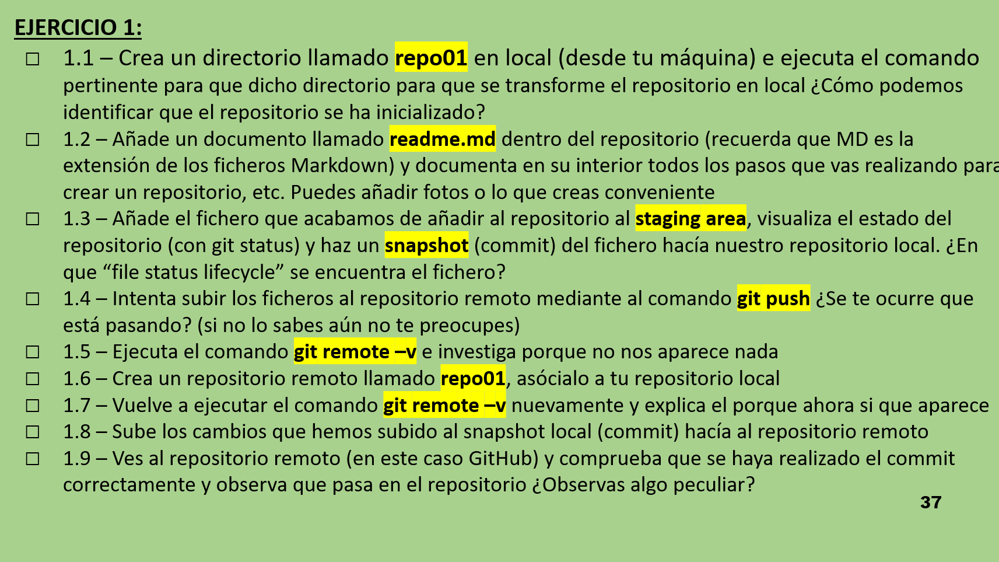

# Ejercicios GIT 1

## Ejercicio 1.1
Antes de nada hemos de asegurarnos que tenemos definidos nuestro **user.name** y **user.email** dentro del entorno **GIT** de nuestro dispositivo.

Si este no es el caso podemos definirlos facilmente con las siguientes fundiones:

- **Username:** *git config --global user.name "Nombre Usuario"*
- **Email:** *git config --global user.email "Email Usuario"*

Una vez hecho esto podemos crear nuestro repositorio local (que se llamará repo01) e iniciarlo como repositorio **GIT**. Para realizar esta última acción hemos de introducir la función:

- *git init repo01*

### *¿Cómo podemos identificar que el repositorio se ha inicializado?*

Pues muy fácil. Dentro de la carpeta activamos la función que nos permite ver archivos ocultos y podremos ver uno llamado **.git**.

## Ejercicio 1.2

Para este subapartado del ejercicio solamente tendremos que crear un fichero Markdown llamado readme donde pondremos las respuestas a los ejercicios.

## Ejercicio 1.3

Para continuar deberemos añadir ese archivo al repositorio y ejecutar el siguiente codigo:

- *git add \**

De eesta manera añadiremos el fichero al **staging area**. Para verificar que lo hemos hecho bien podemos ejecutar la siguiente linea:

- *git status*

Si vemos nuestro fichero resalatado en verde estamos preparados para poder realizar el **commit**:

- *git commit -m "Commit"*

### *¿En que "life status cicle" se encuentra el fichero?*

Nuestro fichero ahora mismo esta en nuestro repositorio local, a la espera de que le indiquemos que los datos se pueden subir a la nube (repositorio remoto).

## Ejercicio 1.4

Ahora solo falta que nuestro fichero se suba al repositorio remoto:

- *git push*

Esta sentencia ahora mismo nos dará error.

### *¿Se te ocurre que esta pasando?*

Lo que pasa es que nuestro repositorio local no esta enlazado a ningun repositorio remoto. Entonces cuando intentamos hacer el **push** el programa no sabe donde tiene que mandar la informacion. 
## Ejercicio 1.5

Para comprobar que este sea el error ejecutaremos:

- *git remote -v*

Ahora, por consola, podremos ver como se nos verifican nuestras sospechas.

## Ejercicio 1.6

Para solucionar esto solo tendremos que asignarle un repositorio remoto. Pero antes, deberemos crearlo. Para eso entraremos en GitHub y crearemos un repositorio nuevo alli. Una vez hecho esto cogemos el enlace del git y ejecutamos lo siguiente:

- *git remote add origin link*

## Ejercicio 1.7

Si volvemos a ejecutar el comando para comprobar que este todo bien nos podremos dar cuenta de que ya no nos sale un mensaje pidiendonos que pongamos un origen. Nos saldra un mensaje con la ruta de nuestro repositorio renoto.

## Ejercicio 1.8

Ahora ya no tendremos problemas para subir nuestro fichero al repositorio remoto:

- *git push*

## Ejercicio 1.9

Ahora si accedemos al repositorio remoto podremos ver nuestro fichero. Si nos damos cuenta se podran ver los contenidos del mismo, no solo los ficheros del repositorio. Eso es porque el contenido que hemos subido era un readme.md y github los muestra de manera automatica en cuanto lo detecta.