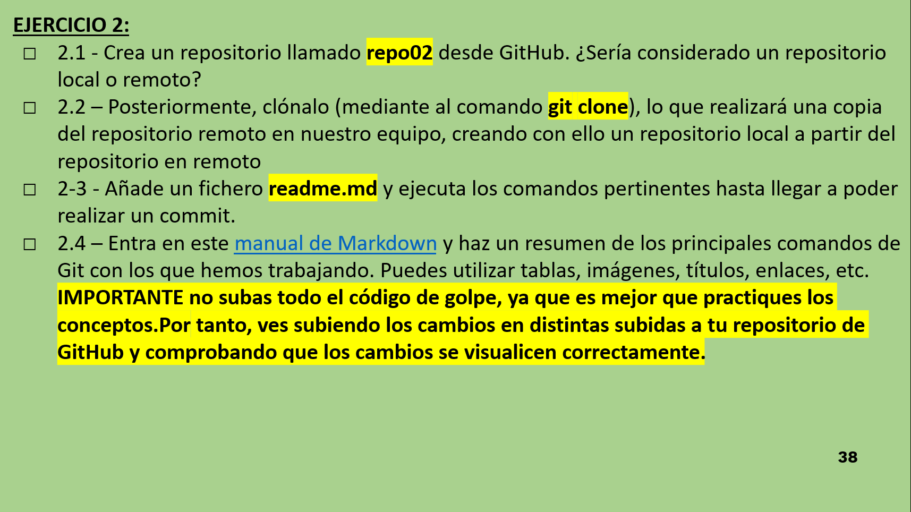

# Ejercicios GIT 2

## Ejercicio 2.1

Para comenzar con este ejercicio tendremos que crear un repositorio en GitHub.

### *¿Sería considerado un repositorio local o rmeoto?*

Es considerado un repositorio remoto, porque de momento solo existe en la nube y no en nuestro dispositivo

## Ejercicio 2.2

Ahora clonaremos el repositorio en nuestro dispositivo con un sencillo comando:

- *git clone link*

## Ejercicio 2.3

Despues si intentamos añadir un fichero (un readme.md por ejemplo) y realizamos un **commit** y posteriormente un **push** podremos observar que al clonar los repositorios locales y remotos se vinculan automaticamente.