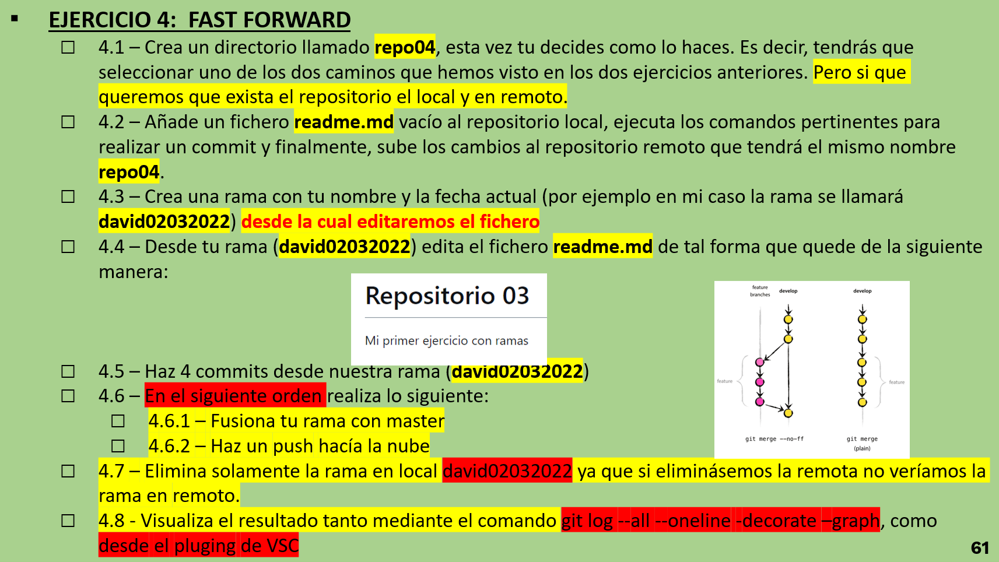

# Ejercicios GIT 4

## Ejercicio 4.1

Para comenzar con el ejercicio creamos un repositorio nuevo en GitHub y lo clonamos en nuestro dispositivo como ya hemos visto anteriormente.

## Ejercicio 4.2

Añadimos un readme donde pondremos paso a paso el procedimientod el ejercicio.

## Ejercicio 4.3

Ahora crearemos una rama cuyo nombre sera la fecha actual y nuestro propio nombre. Para realizarlo ejecutaremos el siguiente codigo:

- *git branch nombreFecha*

## Ejercicio 4.4

Ahora tenemos una rama que, de momento, es exactamente identica al main. Cambiaremos eso modificando el readme de la nueva rama. Entonces lo primero que tenemos que hacer es posicionarnos en la rama:

- *git checkout nombreRama*

Ya estamos localizados en la rama, ahora solo modificaremos el readme.

## Ejercicio 4.5

Para continuar con el ejercicio modificaremos cuatro veces el readme y cada vez realizaremos un commit diferente.

## Ejercicio 4.6

Ahora fusionaremos las dos ramas. Para eso nos posicionaremos en la rama main (como hemos eseñado anteriormente). Justo después ejecutaremos lo siguiente:

- *git merge -ff nombreRama*

Una vez ejecutado nuestras dos ramas se fusionaran en una. 

También, como queremos que estos cambios se guarden en la nube, realizaremos un push justo después.

## Ejercicio 4.7

Ahora nos interesa que la rama que habiamos creado anteriormente este eliminada en nuestro repositorio local. Para realizar esta tarea nos posicionamos en una rama que no queremos eliminar y ejecutamos el siguiente codigo:

- *git branch -d nombreRama*

## Ejercicio 4.8

Ahora visualizaremos el resultado de una manera vistosa con el siguiente comando:

- *git log --all --oneline --decorare --graph*