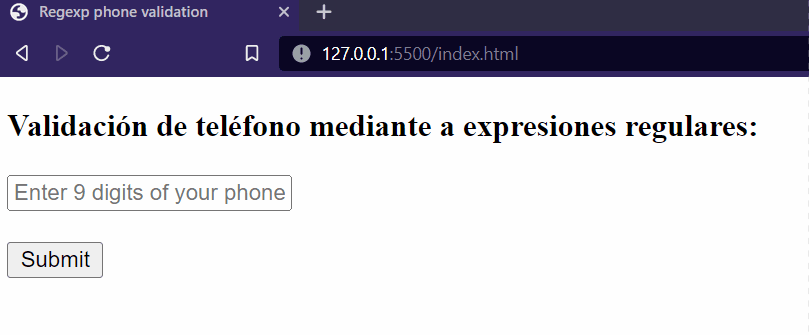

# Ejercicio 5 HTML: Form Input Regex

Realiza un formulario que contenga un input en el que se
realice la validación de si tenemos un número de teléfono con 9 dígitos. En caso de no ser de 9 dígitos, deberá de aparecer un error y no poder realizar el envío del formulario. Para ayudar al usuario haz que aparezca un placeholder indicando que el número de teléfono deberá de tener 9 dígitos.

Para resolver el regexp puedes apoyarte del siguiente tutorial: https://stackoverflow.com/questions/71956383/how-i-use-regex-pattern-in-html-text-input-to-validate-phone-number

